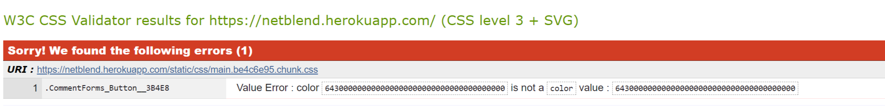
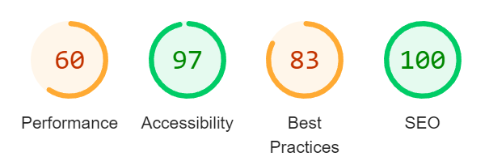
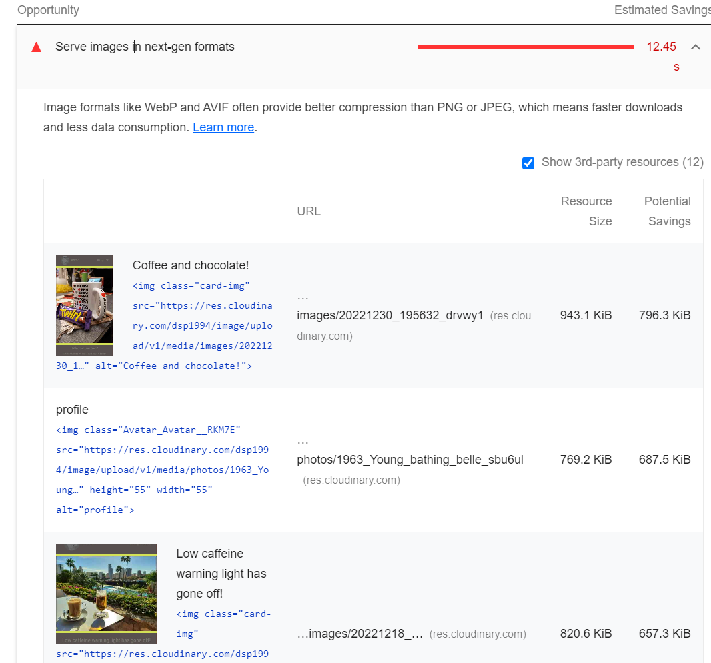
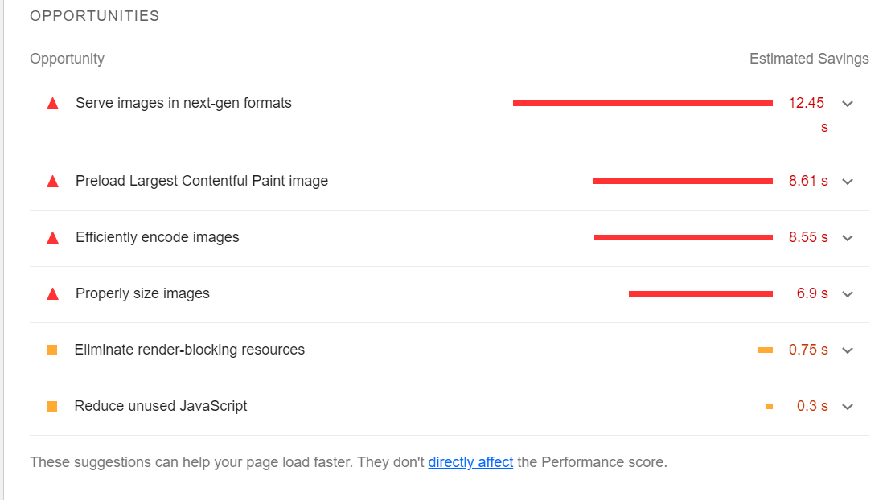
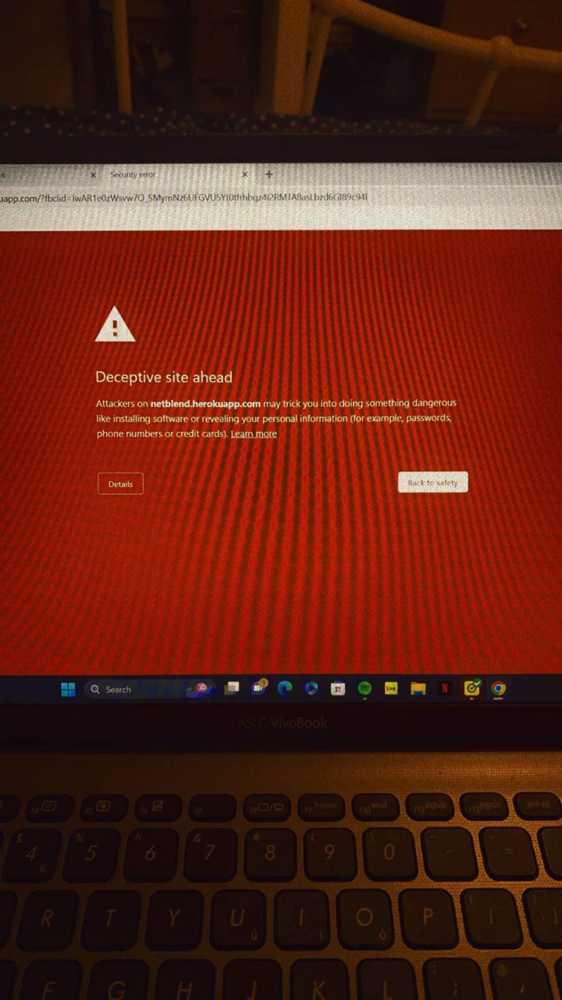
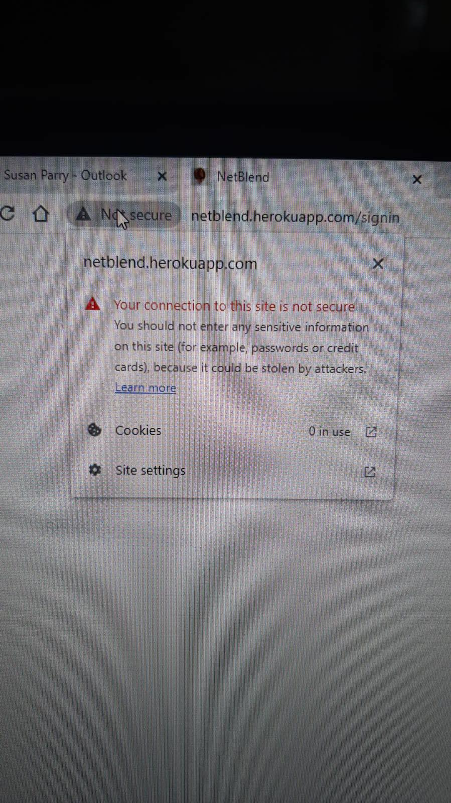

# **Netblend Social Site!**

---

Netblend is a social media website where the inter**NET** and coffee beans (that get **BLEND**ed together to make drinkable goodness), merge to one! Users are able to share photos of their best looking coffee's, create articles and set up events to meet with other coffee fanatics!

- The repository for the DRF-API that is linked to this project can be found [HERE](https://github.com/DSP1994/NetBlend_API). This will come with its own Readme file, so please head over there to have a read of that. Thank you.

---

## Live Sites

### Deployed Frontend [LIVE](https://netblend.herokuapp.com/)

### Deploy Backend API [LIVE](https://netblend-api.herokuapp.com/)

---

### **Site View Across Various Devices**


## Content

---

- [UX](#ux)
  - [Site Purpose](#site-purpose)
  - [Site Goal](#site-goal)
  - [User Stories](#user-stories)
- [Design](#design)
  - [Wireframes](#wireframes)
  - [Colour Scheme](#colour-scheme)
  - [Typography](#typography)
  - [Imagery](#imagery)
- [Features](#features)
  - [Nav Bar](#navbar)
  - [Add Photos](#add-photos)
  - [Profile](#profile)
  - [Followed Profiles](#followed-profiles)
  - [Liked Photos](#liked-photos)
  - [Posts/Uploads](#postsuploads)
  - [Articles](#articles)
  - [Add Articles](#add-articles)
  - [Events](#events)
  - [Add Events](#add-events)
  - [Sign In/Up Functions](#sign-inup)
  - [Not Found Page](#not-found-page)
- [Future Features](#future-features)
- [Testing](#testing)
- [Bugs & Fixes](#bugs--fixes)
  - [Unknown Errors](#Unknown-Errors)
- [Technology](#technology)
  - [Languages](#languages)
  - [Frameworks, libraries, programmes](#frameworks-libraries-programs)
- [Project Set Up](#project-set-up)
- [Components](#components)
- [Deployment](#deploymenmt)
- [Credits](#credits)
- [Acknowledgements](#acknowledgements)

---

## **UX**

---

### **Site Purpose/Goal**

To allow those with similar tastes and interests to share their love and passion to others, through various ways, photos, texts or meet ups. The goal is to bring together those from all over the world, through one enjoyment/passion.

### **User Stories**

You can find a list of the user stories [here](src/readme/Userstories.md).

## **Design**

---

### **Wireframes**

#### Home Page

##### Mobile

##### Desktop

##### Form Page

##### Site Navigation

### **Colour Scheme**


### **Typography**

All fonts for this project were taken from the Google Fonts Library;

1. Abel, Regular
2. Roboto Condensed, Regular

### **Imagery**

The imagery used for the [Not Found Page](#not-found-page), in the [Add Photos](#add-photos) section and in the [Sign Up/In](#sign-inoutup), were taken from Pinterest. Unfortunately I have lost the author, but I'm not sure they were the ones who took the photo, so not sure who best to give credit too!

## **Features**

---

### Navbar

#### Mobile


#### PC


### Add Photos


### Profile


### Followed Profiles


### Liked Photos


### Posts/Uploads


### Articles


### Add Articles


### Events


### Add Events


### Sign In/Up


### Not Found Page


---

## **Future Features**

With more experience and understanding of react there are a number of features I'd love to add in the future, including the following;

- A confirmation warning if a user is about to delete something.
- The ability to expand a profile picture to see the full thing.
- Allowing users to share their posts to other social media sites via a share button.
- Comments on articles and events would be amazing.
- Notifications to the users phone or email when someone else interacts with _anything_ that they have posted.
- Most importantly, **block** certain users, to allow users the freedom to hide their pages from who they wish.

---

## **Manual Testing**

1. CRUD functionality has been tested for each of the following: Posts | Articles | Events | Comments | Likes | Follow | Profile

- Likes & Follow may only be created & deleted
- Profile may only be updated

2. Navigation links open to the correct pages.
3. Pages intended for logged-in users only will send logged-out users back to the home page.
4. Users trying to edit content that they did not publish are sent back to the home page.
5. Users are able to create a new account.
6. Users with an existing account are able to log in.
7. Each user has the ability to log out.

### **Validator Testing**

1. WC3 Testing
   
   The error that has been brought up in the W3C, I believe, is to do with Bootstrap, as I am unable to find the CSS title anywhere in my coding. Apart from this, there are no other errors. There are a few warnings, which stem from Bootstrap, which is beyond my scope and understanding as a newbie coder.

2. Lighthouse Testing

   
   
   

   My performance on the page is not where I would want it to be, however even Facebooks Performance is only 62! So this shows me that there is plenty of room for improvement. The majority of the issues come from the photo uploads that users post, maybe in the future I will be able to impliment code that reduces the image size (the gb/mb not the height/width) that will allow the site to perform better.

3. Site opens on mobiles (safari) & Chrome.

   ! [Mobile View](/src/readme/Mobile%20View.jpg)

---

## **Bugs & Fixes**

The various bugs and errors I encountered can be found [here](src/readme/errors/Errors.md).

### **Unknown Errors**

Upon asking friends and family to try creating a profile, editing said profile, uploading photos/articles etc, I found that there was another error that I was unable to solve. My best speculated guess is that due to the lack of safety features on the site, that come with most large social media sites, a number of anti-virus softwares try to block access to the site for fear of it harbouring viruses. I'm not sure how best to fix this.



---

## **Technology**

---

### Languages

- HTML5
- CSS3
- Javascript
- Python
- SQL - Postgres

### Frameworks, Libraries, Programs

- Google Fonts
- Font Awesome
- GitPod
- GitHub
- Am I Responsive
- Favicon
- Django
- React-Bootstrap
- DrawSQL
- ReactJS

---

## **Components**

These have been used throughout my project;

1. axiosDefault.js
2. ImageSpinner.js
3. OwnerDropdown.js
4. CurrentUserContext.js
5. ProfileDataContext.js
6. useClickOutsideToggle.js
7. useRedirect.js
8. utils.js

---

## **Deploymenmt**

---

The site was deployed to Heroku. The steps to deploy are as follows:

1. Launch the gitpod workspace.
2. Install ReactJS:

```
npx create-react-app . --use-npm
npm start
```

2. Install the following packages using the command `npm install`:

```
react-bootstrap@1.6.3 bootstrap@4.6.0
react-router-dom@5.3.0
axios
react-infinite-scroll-component
msw --save-dev
jwt-decode
-g eslint
```

3. Git add, commit, and push changes to gitpod.
4. Create the project app on Heroku, and link the GitHub repository by navigating to the 'Deploy' tab.

### Connecting to the API:

1. Navigated to the Heroku app of the project DRF-API, and under the Settings tab, added the following configvars:

- Key: CLIENT_ORIGIN | Value: https://react-app-name.herokuapp.com
- Key: CLIENT_ORIGIN_DEV | Value: https://gitpod-browser-link.ws-eu54.gitpod.io

2. Check that the trailing slash `\` at the end of both links has been removed, and save the configvar pairs.
3. Install the Axios package, & create supporting `axiosDefaults.js` as shown in [Moments Walkthrough](https://github.com/Code-Institute-Solutions/moments/blob/cf955d2f2e6f70f61c92d1f9de85558d8e49f3a8/src/api/axiosDefaults.js).

### Deploy to Heroku:

1. In the `scripts` section of `package.json` in gitpod, added the following command:

```
"heroku-prebuild": "npm install -g serve",
```

2. Add Procfile to project root & populate with the following:

```
web: serve -s build
```

3. Repeat the steps of git add/commit/push.
4. Deploy the project via the deploy button on Heroku.

### Deploy to Render & ElephantSQL:

- Due to Heroku revoking their frie tier access, the project has been redeployed using (ElephantSQL)[https://www.elephantsql.com/] using the following [instructions](https://code-institute-students.github.io/deployment-docs/41-pp5-adv-fe/pp5-adv-fe-drf-01-create-a-database)

## **Credits**

The Code Institute's Moments walkthrough was an insane help for this project, and their coding can be found throughout this project. It was also a great starting point when I started to impliment my own apps; events and articles.
The tutors at The CI have a very special place in my heart for their patience and help with my many errors, I am extremely grateful for them and their help.

---

## **Acknowledgements**

I would like to give a special thanks to Gemma, Oisin, Martin, Ed and Alan (and probably a few more!) in the CI's tutor support. They really did save my bacon and helped me through some extremely difficult errors.

I am also extremely grateful to my girlfriend, for allowing me the space I need to crack on and push through this project, I have neglected her a little too much by sometimes spending 12-14 hours a day trying to code on our days off from work. Time to go outside and enjoy the sun, a beer and some quality time with her.
